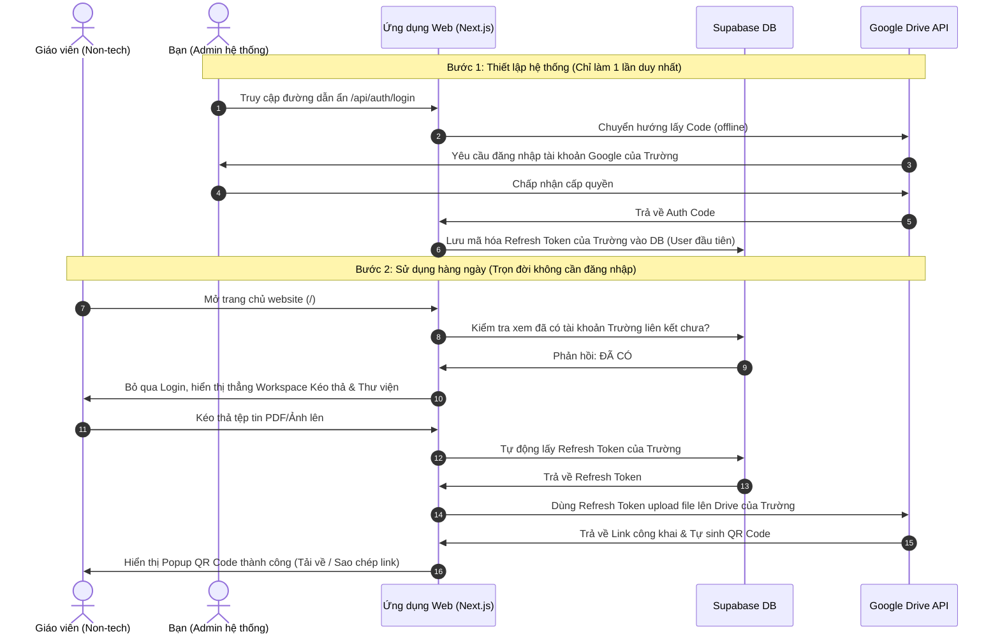

# Tài liệu Thiết kế Kiến trúc: Tài khoản Google Drive Tập trung (Centralized Mode)

Tài liệu này ghi chép lại ý tưởng, phân tích kiến trúc và kế hoạch nâng cấp hệ thống **ScanToQR** từ mô hình *"Đa người dùng đăng nhập cá nhân"* sang mô hình *"Tài khoản lưu trữ tập trung (Kiosk/Public Mode)"* nhằm tối giản hóa tối đa trải nghiệm người dùng cuối (giáo viên non-tech).

---

## 1. Bản chất Ý tưởng & Lợi ích thực tế

### 💡 Ý tưởng cốt lõi:
Thay vì bắt buộc từng người dùng (giáo viên mầm non) khi truy cập web phải đăng nhập tài khoản Google cá nhân của họ để kết nối Drive:
* **Nhà trường (Admin):** Chỉ đăng nhập tài khoản Google của trường (hoặc tài khoản đại diện) **1 lần duy nhất** để hệ thống lấy và lưu trữ `google_refresh_token` cố định vào cơ sở dữ liệu.
* **Người dùng cuối (Giáo viên):** Khi mở website lên sẽ **không cần đăng nhập bất cứ tài khoản nào cả**. Họ được đưa thẳng vào giao diện kéo thả Workspace và Thư viện tệp tin. Hệ thống sẽ luôn dùng tài khoản Google tập trung của trường để upload, chia sẻ công khai và tạo mã QR.

### 🌟 Lợi ích vượt trội:
1. **Rào cản công nghệ bằng 0:** Người dùng non-tech (giáo viên lớn tuổi) mở web là dùng được ngay lập tức, không cần biết đăng nhập Google, không sợ lỗi xác thực.
2. **Dùng chung thư viện trường học:** Tất cả giáo viên có thể duyệt, xem nhanh mã QR và quản lý các tệp tin đã tạo của nhau trên một bảng chung, tăng tính phối hợp trong công việc.
3. **An toàn bảo mật cá nhân:** Giáo viên không cần phải cung cấp quyền truy cập Drive cá nhân của họ cho ứng dụng.

---

## 2. Sơ đồ luồng hoạt động (Sequence Diagram)



---

## 3. Kế hoạch sửa đổi mã nguồn (Khi cần nâng cấp)

Khi bạn muốn triển khai nâng cấp này trong tương lai, dưới đây là các tệp tin cần chỉnh sửa cụ thể:

### 📂 Tệp 1: API Route Upload (`/api/drive/upload/route.ts`)
* **Hiện tại:** Kiểm tra session cookie của người dùng, lấy `userId` giải mã và truy cập DB.
* **Thay đổi:** 
  1. Bỏ qua hoàn toàn bước check cookie session (`scan_to_qr_session`).
  2. Thay đổi câu lệnh truy vấn Supabase để lấy tài khoản đầu tiên trong bảng `users`:
     ```typescript
     // Lấy tài khoản đầu tiên được cấu hình trong DB (tài khoản trường học)
     const { data: user, error: dbError } = await supabaseAdmin
       .from('users')
       .select('id, google_refresh_token')
       .order('created_at', { ascending: true })
       .limit(1)
       .single();
     ```
  3. Sử dụng `userId` này để lưu lịch sử tạo QR vào bảng `history_qr`.

### 📂 Tệp 2: API Lịch sử & Xóa (`/api/drive/history/route.ts` & `/api/drive/delete/route.ts`)
* **Thay đổi:** 
  1. Bỏ qua bước kiểm tra session cookie từ client.
  2. Tự động lấy `userId` của tài khoản trường học đầu tiên trong DB để trả về toàn bộ danh sách lịch sử tệp tin (`history_qr`) cho mọi người dùng cùng xem chung, hoặc xử lý hành động xóa tệp tin.

### 📂 Tệp 3: Giao diện Trang chủ (`app/page.tsx`)
* **Hiện tại:** Hiển thị nút "Tiếp tục với Google" bắt buộc đăng nhập.
* **Thay đổi:** Chuyển đổi trang chủ thành Server Component kiểm tra trạng thái tự động:
  ```typescript
  // Truy vấn kiểm tra xem hệ thống đã được cấu hình tài khoản trường chưa
  const { data: configExists } = await supabaseAdmin
    .from('users')
    .select('id')
    .limit(1);

  if (configExists && configExists.length > 0) {
    // Nếu đã cấu hình tài khoản trường, cho phép vào thẳng Dashboard tự do!
    // (Ta có thể lưu một Session giả lập cho khách hoặc hiển thị thẳng Dashboard)
    redirect('/dashboard'); 
  } else {
    // Nếu chưa cấu hình (lần đầu tiên chạy app), hiển thị giao diện đăng nhập Google
    return <RenderLoginScreen />;
  }
  ```

### 📂 Tệp 4: Giao diện Dashboard (`app/dashboard/page.tsx`)
* **Thay đổi:** Bỏ qua check cookie session. Định nghĩa một profile giả lập (Mock User) để truyền vào Component `<DashboardClient user={mockUser} />` (ví dụ: `name: "Trường mầm non Vĩ Thượng"`) giúp hiển thị tên trường trên thanh điều hướng Nav thay vì tên cá nhân giáo viên.

---

## 4. Cách quản lý và cập nhật tài khoản Trường

* **Thiết lập lại hoặc thay đổi tài khoản Google của Trường:**
  Bạn chỉ cần truy cập vào đường dẫn ẩn `/api/auth/login` trên trình duyệt. Luồng xác thực Google OAuth sẽ mở ra, bạn đăng nhập tài khoản Google mới và hệ thống sẽ tự động cập nhật lại `refresh_token` mới trong cơ sở dữ liệu. Mọi hoạt động của giáo viên sau đó sẽ tự động chuyển sang lưu trữ trên tài khoản Drive mới này!

---

## 5. Giải pháp phân tách và quản lý Lịch sử QR cho từng Giáo viên

Khi chuyển sang mô hình tài khoản dùng chung (Centralized Account), tuy toàn bộ tệp tin đều được tải lên **một tài khoản Google Drive duy nhất của Trường**, chúng ta vẫn cần đảm bảo mỗi giáo viên chỉ xem và quản lý được danh sách các mã QR do chính mình tạo ra.

### 💡 Giải pháp tối ưu: Định danh bằng "ID Thiết bị" + "Biệt danh Lớp học" kết hợp `localStorage`

Giải pháp này hoàn toàn miễn phí, 100% tự động và cực kỳ mượt mà với người dùng phi kỹ thuật:

#### 1. Khởi tạo & Định danh tự động ở phía Client
* Khi giáo viên truy cập trang web lần đầu tiên, ứng dụng sẽ kiểm tra trong `localStorage` của trình duyệt trên điện thoại/máy tính của họ:
  * Nếu chưa có, hệ thống tự động sinh một chuỗi định danh ngẫu nhiên duy nhất (ví dụ: `thietbi_8f9a2b`) và lưu lại dưới tên `teacher_device_id`.
  * Đồng thời, hệ thống cung cấp một nút nhỏ trên thanh điều hướng cho phép cô đặt **Biệt danh/Lớp học** (ví dụ: `Cô Hoa - Lớp Mầm 1` hoặc `mam_1`) để đồng bộ và dễ quản lý.
* Thông tin này được lưu trữ vĩnh viễn trong `localStorage` của máy nên cô chỉ cần thao tác **một lần duy nhất** lúc bắt đầu sử dụng.

#### 2. Cải tiến cấu trúc cơ sở dữ liệu (Supabase)
* Thêm hai cột mới vào bảng `history_qr`:
  * `device_id` (text): Lưu mã ID thiết bị ngẫu nhiên của giáo viên.
  * `teacher_name` (text, optional): Lưu biệt danh lớp/tên giáo viên.
* Thiết lập Index trên cột `device_id` để tăng tốc độ truy vấn lịch sử.

#### 3. Cập nhật luồng xử lý API
* **Khi tải tệp tin lên (`/api/drive/upload`):**
  * Client sẽ đính kèm thông tin `device_id` và `teacher_name` (từ `localStorage`) vào dữ liệu gửi lên.
  * API backend nhận thông tin và lưu kèm vào bảng `history_qr` của cơ sở dữ liệu.
* **Khi lấy danh sách lịch sử (`/api/drive/history`):**
  * Client gửi kèm `device_id` của thiết bị trong request.
  * API backend thực hiện truy vấn lọc:
    ```sql
    SELECT * FROM history_qr WHERE device_id = :device_id ORDER BY created_at DESC;
    ```
  * Điều này đảm bảo cô Hoa chỉ thấy lịch sử mã QR của lớp cô Hoa, cô Lan chỉ thấy của lớp cô Lan.

#### 4. Khả năng đồng bộ chéo thiết bị
* Nếu cô Hoa muốn đồng bộ lịch sử mã QR từ điện thoại cá nhân sang máy tính của lớp học, cô chỉ cần nhập cùng một **Biệt danh/Lớp học** (ví dụ: đặt chung là `mam1`) trên cả hai thiết bị.
* Hệ thống sẽ tự động ghép nhóm dữ liệu theo biệt danh này để lịch sử hiển thị giống nhau trên mọi thiết bị mà cô Hoa sở hữu.

#### 🌟 Điểm cộng vượt trội của mô hình này:
* **Không cần mật khẩu:** Giáo viên không bao giờ lo quên mật khẩu hay phải khôi phục tài khoản.
* **Bảo mật và riêng tư tuyệt đối:** Dù dùng chung bộ nhớ lưu trữ Drive của trường, giao diện sử dụng của mỗi giáo viên vẫn hoàn toàn tách biệt và cá nhân hóa.
* **Admin dễ dàng quản lý:** Vì toàn bộ file thực tế tập trung trên Drive trường, Ban giám hiệu/Admin có thể kiểm duyệt, dọn dẹp hoặc sao lưu dữ liệu toàn trường ở một nơi duy nhất.
